COSI 119A Final Project Arm Interfacing
===============

Jacob Smith, Fall 2019, Brandeis University

My project is to interface an arm to the mutant campus rover.

See the project Proposal in extras folder

using [VarSpeedServo](https://github.com/netlabtoolkit/VarSpeedServo) Library as background code, all my work is in examples and extras folder

Functionality so far

### Oct 25-31:

#### Getting Arm to Move

(provided)  Sweep Controls Servo on Port 7

(provided) *RobotArmScript* Arduino Program to control rest of the Arm

#### Getting Arduino to talk to Rasberry Pi

*(provided)  ArmArduinoV1*, lets the Arduino talk to the Pi

*(provided)  PiArduinoV1* lets teh Pi talk to the Arduino

​					Screenshot showing Message from Arduino being printed on Rasberry Pi

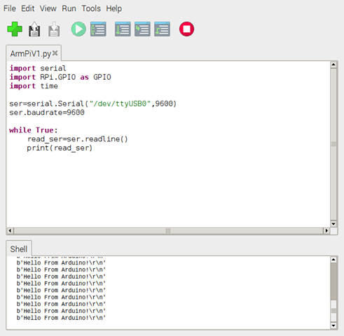

#### **Getting Rasberry Pi to Talk to Arduino**

(provided)  ArmArduinoV2*, lets the Arduino talk to the Pi

*(provided)  PiArduinoV2* lets the Pi talk to the Arduino

​	It sends a serial command to the Arduino, which reads it and moves the servo

​	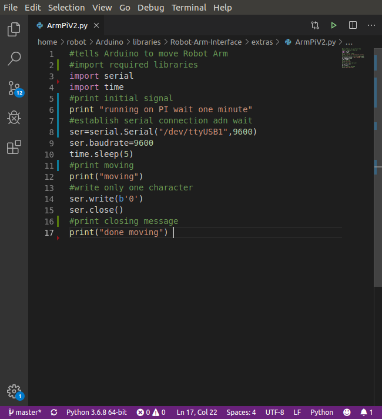

#### **Workflow improvements**			

​		Now that the basic premise was set up, I remounted the Servo Arm onto a robot chassis. Also, I can log into the mutant robot and execute python scripts over ssh. 

​				`ls /dev/tty*`		Lists available USb ports, look for USB 0

​				`ssh mutant@mutant.dyn.brandeis.edu 'python' < '/home/robot/catkin_ws/src/arminterface/Raspi/ArmPiV4.py'`      Executes a python file on ssh without copying that file to the mutant rasberry Pi, 40 second time lag

​		These workflow improvements should allow me to test the arm much more quickly than plugging in to the mutant and and plugging in the arm etc.

​			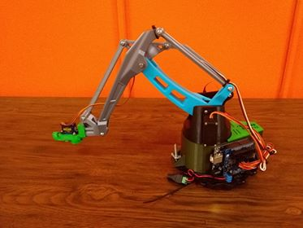

​		Also, I am running the commands on the mutant robot, where the arm now has a port.

#### **Two Way Communication**

​		*ArmArduinoV3*, Opens the gripper if receives o character over serial, closes if c character

​		*PiArduinoV3* Sends the open and close characters, also two way communication

​		This is the simplest expression of the interface required for the final project.

​			First, we check that the arm shows up in hte list of USB ports as USB 0

​					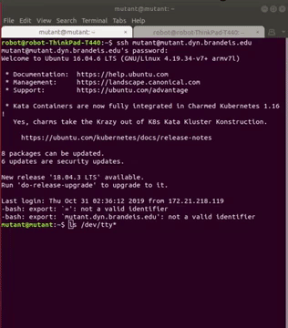

​		Then, we run the ArmPiV3 script over ssh, which moves the arm and displays output

​					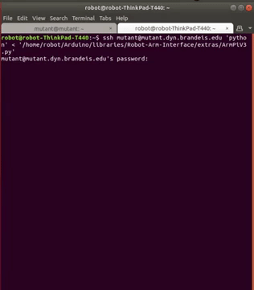

​			Finally, the servo opens and closes!

​					Here is a video of this stage:

​						 

#### Future Work

​			The main future goal is to interface the arm to ROS. In the short term, I want to decrease the lag, enable the arm to respond to keyboard input, and get the arm fixed

### Nov 1-7:

This week, I focused on the hardware of the arm, taking it apart, putting it back together, and mounting it to the Mutant Robot. Version 4 of the Arduino and Pi scripts show updated functionality, where the whole arm can be controlled.

​	First, I replaced the broken motors on the arm, this shows the base motor rotating after I lined it up again 	absolute position matters for servos):

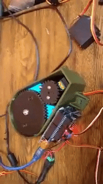

​	Then, I mounted the arm on the mutant, note how there is enough clearance for the lidar because of the 	washers I added:

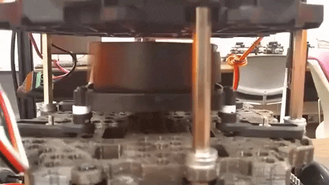

​	Version 4 of my scripts allow mulktiple parts of the arm to be controlled, shown here is the console output and robot motion.

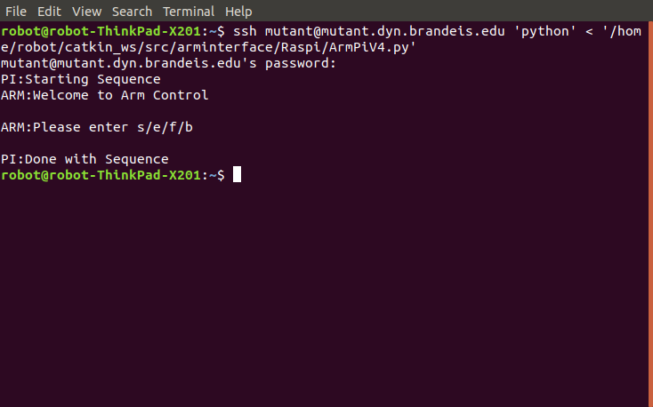

A video of this week's work can be found [here](https://www.youtube.com/watch?v=U1VSVlQWPBY) 

**Future Work:**

By Next week, I will have communicated with Charlie about the battery and broken motors, and plugged the arm into a publisher/subscriber model in ROS. The deliverable will be a video of me moving the arm as I did this week but with ROS scripts.

### Nov 8-15

Update: Charlie remounted the arm, I wrote the bringup and roscore script and it works over ssh, the arm moves using rostopic publisher and subscriber, subscriber has nice error handling like if usb times out.

Sssh Script problem: It seems that running roscore in ssh command doesn't work even though it works in an interactie session. i tired allowing mutant to allow user environment variables, but the problem persists. Even though i haven't figured anything out, i am learning a lot about linux and how to use vim. I also tried specifying the exact directory location of roscore file, but I go this error https://www.howtoforge.com/vim-basics

Here is a gif of the bash script working, no more opening multiple terminals to run roscore, bringup, and the nodes!

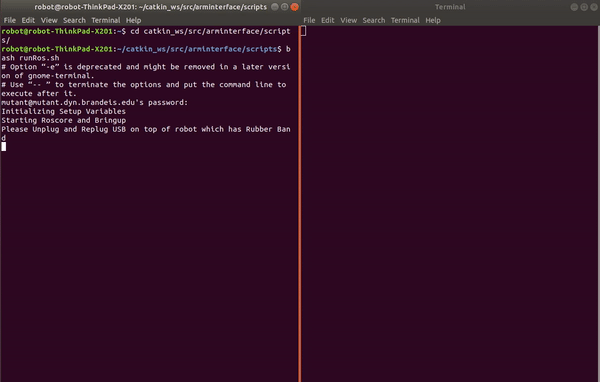

Here is the arm top mounting that Charlie did, now the arm doesn't get in the way of the lidar's field of vision.

Future work: Upload python file remotely, implement ROS actions, implement sensor control.

#### Running Instructions

1. Get Charged Battery

2. Turn Mutant Robot On

3. run `cd ~/catkin_ws/src/arminterface/scripts`

4. run `bash runRos.sh` and follow instructions 

   ### Nov 15-22

   Feedback from testing arm with TA

   ​	roscd

   ​	Explain what publihser subscriber do

   ​	stop unplug replug

   ​	 Time took : 2:18, 2:33

   ​	Be interactive

   ​	Dont continue usb if unpluged

   ​	What threw you off the most? new terminal window

   ​			explain what that window does

   ​	Is the command line interface good?

   ​			yeah	

   ​	The API is more important than the user application

   ​	better reset condition

   ​	avoid typing in password

   ​	1:10 usablity 8

   
   
   Meeting with Pito :
   
   ​		I need to write a generic and reliable ROS node and not get sucked in to 
   
   ​		Get to coordinate engage, write this so you could use it for a different arm
   
   ​		Then maybe write an action.
   
   ​		Add Ultrasonic Sensor
   
   ​		Possibly write angle information.
   
   ​		Main priorities: generic interface, ultrasonic sensor, and fun demo 
   
   
   
   General Interface:
   
   ​	The things we need to do: send commands
   
   
   
   | Goal                | Arduino Command                       | Inputs other than Name | Outputs      | Wait | Comment                 |
   | ------------------- | ------------------------------------- | ---------------------- | ------------ | ---- | ----------------------- |
   | Get Distance        | distancesensor.getDistance();         |                        | Distance     | No   | Type Output Sensor      |
   | Set Arm Coordinates | set_arm(100, 200, 90, 0  servoSpeed); | 4 coordinates, speed   | Still Moving | Yes  | Type 4 Coordinate       |
   | Set Manipulator     | manipulator(true =open/false =code);  | open or close          | Still Moving | Yes  | Type Binary Manipulator |
   
   ROS outline
   
   ​	Node: Publish distance to topic 
   
   ​	Action: Control arm and manipulator (one or two actions)
   
   Then I have a node publishing Arduin commands, which keeps the Arduino code pure	
   
   https://raspberrypi.stackexchange.com/questions/13455/how-to-force-rescan-of-usb-serial-devices
   
   https://stackoverflow.com/questions/41560818/usb-serial-data-sending-gibberish
      2:15 PM: Pito says I'll have a serial Node which publishers serial data, then another ROS node which parses the data. Pito Recommends that I use a struct instead of plain text. 

   ​	Another problem is that other students need to use the robot with an arm on it. I want to take off the arm so it can work on any robot anyway, but I need to fix the ssh error. 

Pito agrees with this serial interface scheme : 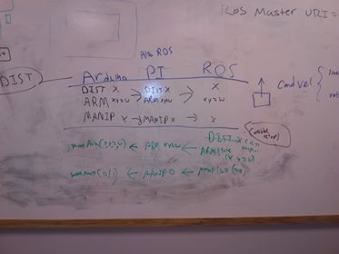

   https://forum.arduino.cc/index.php?topic=396450

   

   Trying to get Servo to tell my if its moving. I set the servo to run for 2 seconds at degree increments, and print whether it was moving. There would  be a spike at 40 and 160 if this method actually could tell if the servo was moving.

   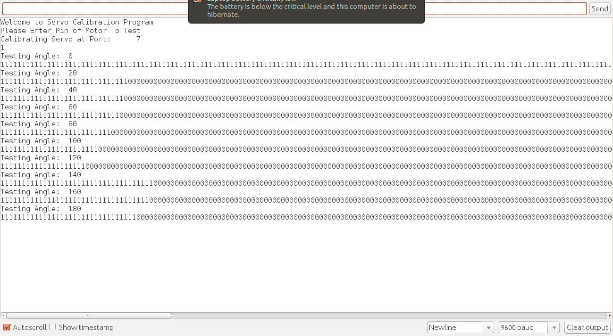

   

   Plotting the number of times the servo moved by different degrees shows that there is no correlation between where the servo is jammed and what the isMoving function returns.

   ​	

   This agrees with what Charly said about the servos having no feedback, but I thought a function named isMoving would return whether the servo is moving. In summary, the servo functions I thought would work don't really.

**November 25** : 

​	I wrote ArduinoV6, which uses a serial interface to control Arm position, manipulator, and and return the distance. 

   ### **Sources**	

  

Setting up simple action example file in my program. Ran it in prrexamples, finishes prints elapsed time. Edited cmake and package. 

​	Ismoving, atttaches limits, stop

​		limits dont seem to work

​		Reason is the limits are in microseconds not angles, here is the conversion from the cpp file of th VarSPeed Srvo class

   ### Sources**	

5. 

SSH Commands manual https://www.freebsd.org/cgi/man.cgi?sshd_config(5)

Edit read only file in vimhttps://www.geekyboy.com/archives/629

How to use vim https://www.howtoforge.com/vim-basics

Links http://gazebosim.org/tutorials/?tut=ros_urdf http://wiki.ros.org/joint_trajectory_controller Pito doesn;t like https://answers.ros.org/question/38694/running-ros-across-multiple-machines/

Non interactive shell information https://www.howtoforge.com/vim-basics https://www.howtoforge.com/vim-basicsS

Permit user enviornmet https://stackoverflow.com/questions/10562722/command-not-found-via-ssh-with-single-command-found-after-connecting-to-termina

Remote run ROS https://askubuntu.com/questions/1156507/cannot-perform-command-after-remote-logging-in-via-ssh

Run remote rs node https://github.com/pandora-auth-ros-pkg/pandora_docs/wiki/Remote-Machines-Running-ROS-nodes

How turtlbebot handles erial connections https://github.com/ros-drivers/rosserial/blob/melodic-devel/rosserial_python/nodes/serial_node.py

Error with running ros I got https://answers.ros.org/question/310848/run_id-on-parameter-server-does-not-match-declared-run_id/

Trying to get positon from servos, Charly convinced me there is no way to get position because there is no position wire.

http://forums.trossenrobotics.com/tutorials/how-to-diy-128/get-position-feedback-from-a-standard-hobby-servo-3279/

Arm is Moving function eixst in varspeedservo

http://forums.trossenrobotics.com/tutorials/how-to-diy-128/get-position-feedback-from-a-standard-hobby-servo-3279/

Error with running node remotely which I had https://answers.ros.org/question/243478/getting-rosgraph-resource-not-found-when-trying-to-get-turtlebot-local_plan/

Rosremote (didn't try) http://wiki.ros.org/ROSRemote

Ros remote machine (didn't try) https://github.com/pandora-auth-ros-pkg/pandora_docs/wiki/Remote-Machines-Running-ROS-nodes

Exception message python https://stackoverflow.com/questions/9823936/python-how-do-i-know-what-type-of-exception-occurred

Add python file to path https://askubuntu.com/questions/470982/how-to-add-a-python-module-to-syspath

ssh python finding module https://stackoverflow.com/questions/6851184/python-cannot-find-module-when-using-ssh		

[1] Links fix Arduino download error https://www.arduino.cc/en/Guide/Linux

[2] Get Arduino to listen to Serial https://www.instructables.com/id/Connect-Your-Raspberry-Pi-and-Arduino-Uno/

[3]Get Pi to talk to Serial https://pyserial.readthedocs.io/en/latest/shortintro.html

[4] Run a Python File remotely https://www.shellhacks.com/ssh-execute-remote-command-script-linux/

Strings don't work in Arduino aarg post https://forum.arduino.cc/index.php?topic=387175.0

Servo min max writing https://forum.arduino.cc/index.php?topic=169501.0